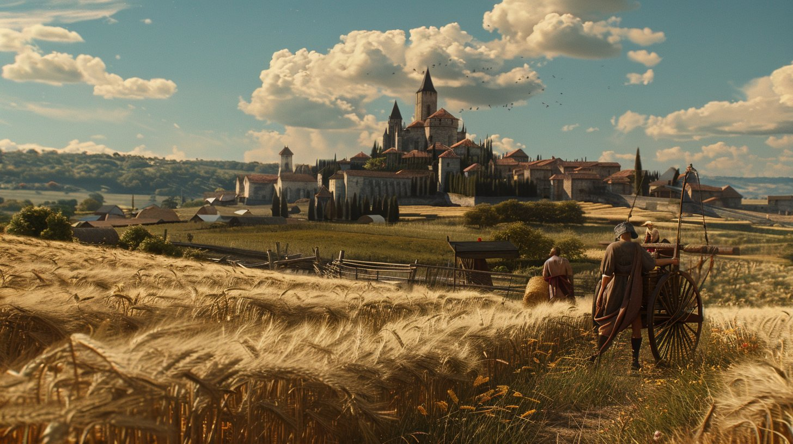

<picture>
  
</picture>

# Kingdom & Lords

The kindom&Lords is a fully on-chain SLG game designed specifically for the Starknet

<picture>
  
</picture>

In the world of "Kingdom&Lords", you embark on an epic journey, where strategy and wisdom go hand in hand, and alliances are forged to conquer new territories. Build your village, develop agriculture and economy, muster a mighty army, and erect invincible walls.
<picture>
  
</picture>

But "Kingdom&Lords" is more than this—it's a realm of social strategy where no hero stands alone, only with brave and wise allies. Every decision you make can alter the course of battle, and your alliance is your unbreakable shield. Send envoys, make allies with heroes from all corners of the world, and fight side by side with players globally to witness the rise of a dynasty.

